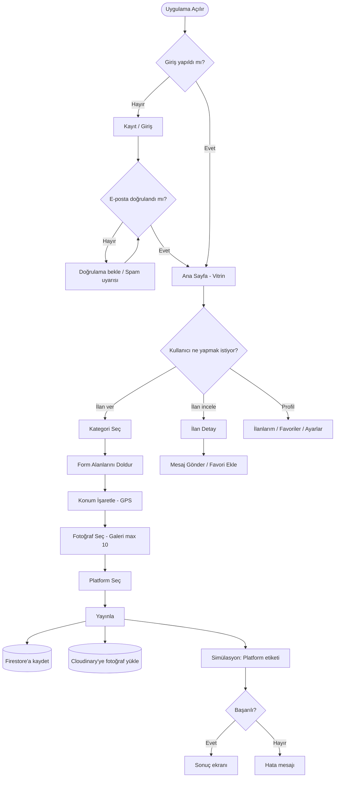
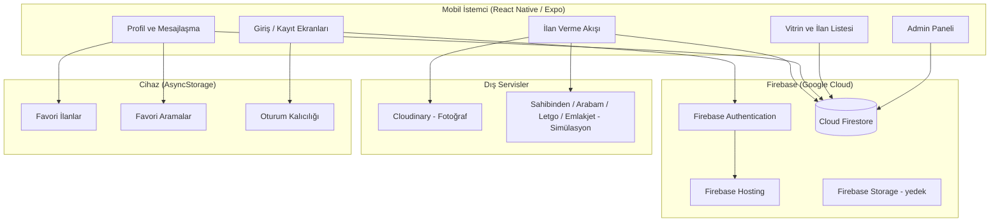
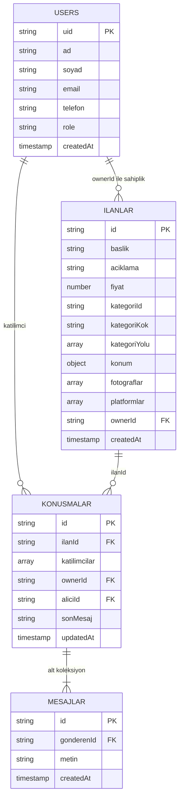
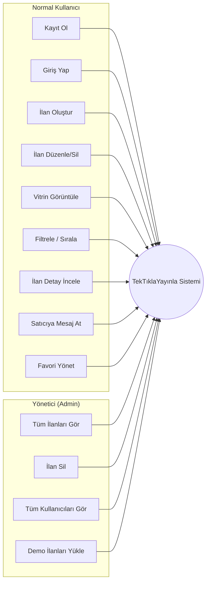

# TekTıklaYayınla — Jüri Tez Şablonu Doldurma Rehberi

> **Kaynak:** `claudenin tezi.docx` (güncel, 9/10 sürüm)  
> **Hedef şablon:** `Bitirme Projesi Tez Şablonu juri için olan.docx`  
> **Nasıl kullanılır:** Jüri şablonunu kopyala → aşağıdaki bölümleri sırayla yapıştır → Word stillerini uygula → şekilleri ekle → içindekileri güncelle.

---

## ADIM 0 — Şablonda SİLECEĞİN bölümler

Jüri şablonunda **senin tezine yazılmayacak** örnek/kılavuz bölümler var. Bunları tamamen sil:

- `TEZİN ŞEKİL ÖZELLİKLERİ` (1.1 Kâğıt Özellikleri… tüm kılavuz)
- `KAYNAK GÖSTERME KURALLARI` (2.1, 2.2… tüm kılavuz)
- `TEZİN KISIMLARI` (3.1 Sıralama… kılavuz)
- Şablondaki örnek tablo/şekil açıklamaları (Word denklem örneği vb.)

**Kalacak sıra:**

1. Dış kapak  
2. Tez Tanıtım Formu  
3. İç kapak  
4. Beyan  
5. Jüri onay sayfası  
6. ÖZET  
7. SUMMARY  
8. İÇİNDEKİLER *(sonda güncelle)*  
9. KISALTMALAR  
10. TABLOLAR LİSTESİ *(sonda güncelle)*  
11. ŞEKİLLER LİSTESİ *(sonda güncelle)*  
12. ÖNSÖZ  
13. BİRİNCİ BÖLÜM — GİRİŞ  
14. İKİNCİ BÖLÜM — SİSTEM ANALİZİ VE TASARIMI  
15. ÜÇÜNCÜ BÖLÜM — GERÇEKLEŞTİRİM VE KULLANILAN TEKNOLOJİLER  
16. DÖRDÜNCÜ BÖLÜM — SONUÇ VE GELECEK ÇALIŞMALAR  
17. KAYNAKÇA  
18. EKLER  
19. ÖZGEÇMİŞ  

---

## ADIM 1 — Word stilleri (her yapıştırmadan sonra)

| Ne | Stil |
|---|---|
| Normal paragraf | `IGU Tez Paragraf` |
| Bölüm başlığı (GİRİŞ, LİTERATÜR…) | `IGU Tez Bölüm Başlık` |
| Alt başlık (1.1., 2.3. vb.) | `IGU Tez Bölüm Başlık 2` |
| ÖZET / SUMMARY / ÖNSÖZ başlığı | `IGU Tez Diğer Bölüm Başlık` |
| Tablo/şekil alt yazısı | `IGU Tez Resim Yazısı` |

---

# BÖLÜM BÖLÜM İÇERİK (KOPYALA-YAPIŞTIR)

---

## KAPAK / TEZ TANITIM / BEYAN / JÜRİ

**Proje adı:** TekTıklaYayınla  
**Hazırlayan:** Esma Rozerin Beyazit  
**Danışman:** Dr. Öğr. Üyesi Serkan Gönen  
**Tarih:** 22.06.2026  
**Sayfa sayısı:** 50+ (bitince güncelle)

### Tez Tanıtım — Dizin Terimleri
```
Mobil uygulama, React Native, Firebase, Firestore, Cloudinary, ilan yönetim sistemi, çoklu platform, simülasyon, kullanıcı kimlik doğrulama, bulut tabanlı veri yönetimi
```

### Tez Tanıtım — Türkçe Özet (kısa)
```
Bu çalışmada, kullanıcıların ilanlarını tek bir mobil uygulama üzerinden yayınlayabilmesini, düzenleyebilmesini ve yönetebilmesini sağlayan TekTıklaYayınla adlı bir sistem geliştirilmiştir. Sistem; React Native ve Expo altyapısıyla Android platformu için geliştirilmiş olup Firebase Authentication, Cloud Firestore ve Cloudinary servislerinden yararlanılmıştır. Emlak, vasıta, ikinci el, iş makinesi ve hizmet kategorilerinde ilan oluşturma, fotoğraf yükleme, konum işaretleme, platform seçimi ve mesajlaşma gibi temel işlevler hayata geçirilmiştir. Güvenlik kapsamında e-posta doğrulama, Firestore güvenlik kuralları ve rol tabanlı erişim denetimi uygulanmıştır. Platform entegrasyonu gerçek API'ler yerine simülasyon mantığıyla modellenmiştir. Elde edilen sonuçlar, sistemin ilan yönetimini kolaylaştıran, kullanıcı dostu ve geliştirilebilir bir prototip niteliği taşıdığını göstermektedir.
```

### Beyan + Jüri sayfası
Şablondaki metni olduğu gibi bırak; sadece ad, tarih ve proje adını doldur.

---

## ÖZET

```
Günümüzde ilan vermek isteyen bireyler ve küçük işletmeler, aynı ilanı farklı platformlarda yayınlamak için her seferinde ayrı ayrı işlem yapmak zorunda kalmaktadır. Bu durum zaman kaybına yol açmakta, kullanıcı deneyimini olumsuz etkilemekte ve süreci gereksiz yere karmaşık hâle getirmektedir. Bu çalışmada söz konusu soruna yönelik kullanıcı odaklı bir çözüm olarak TekTıklaYayınla adlı mobil tabanlı bir sistem geliştirilmiştir.

Sistem, React Native ve Expo çerçevesi kullanılarak Android platformu hedef alınarak geliştirilmiştir. Kullanıcı kimlik doğrulama ve yönetimi Firebase Authentication ile sağlanmış; ilan, kullanıcı profili ve mesajlaşma verileri Cloud Firestore veritabanında saklanmıştır. İlan fotoğrafları ise Cloudinary bulut depolama hizmeti üzerinden yönetilmektedir.

Uygulama; emlak, vasıta, ikinci el, iş makinesi ve hizmet olmak üzere beş ana ilan kategorisini desteklemektedir. Her kategori için alt kategoriler ve kategoriye özel form alanları tanımlanmıştır. Konum bilgisi GPS ile alınabilmekte, galeriden çoklu fotoğraf seçimi yapılabilmektedir. Sahibinden, Arabam.com, Letgo ve Emlakjet gibi platformlara ilan gönderme işlemi, mevcut aşamada simülasyon mantığıyla modellenmiştir.

Güvenlik açısından; e-posta doğrulama zorunluluğu, Firestore güvenlik kuralları ile rol tabanlı erişim denetimi (kullanıcı / admin) uygulanmıştır. Kullanıcılar kendi ilanlarını yönetebilmekte, favori ilanlar ve aramalar cihazda saklanmakta, iki taraflı mesajlaşma gerçekleştirilebilmektedir.

Elde edilen sonuçlar, geliştirilen sistemin ilan yönetimi sürecini basitleştiren, güvenli ve kullanıcı dostu bir prototip niteliği taşıdığını göstermektedir. Gerçek platform API entegrasyonu ise gelecekteki geliştirmeler arasında planlanmaktadır.
```

**Anahtar Kelimeler:** Mobil uygulama, React Native, Firebase, Firestore, Cloudinary, ilan yönetim sistemi, çoklu platform simülasyonu, kullanıcı kimlik doğrulama, konum tabanlı hizmet

---

## SUMMARY

```
Today, individuals and small businesses who want to publish the same advertisement on multiple platforms are required to perform separate actions for each platform. This situation leads to loss of time, negatively affects user experience, and unnecessarily complicates the process. In this study, a mobile-based system called TekTıklaYayınla was developed as a user-centered solution to this problem.

The system was developed targeting the Android platform using the React Native and Expo framework. User authentication and management are provided through Firebase Authentication; advertisement, user profile, and messaging data are stored in the Cloud Firestore database. Advertisement photos are managed through the Cloudinary cloud storage service.

The application supports five main advertisement categories: real estate, vehicles, second-hand items, construction machinery, and services. Sub-categories and category-specific form fields are defined for each category. Location information can be obtained via GPS, and multiple photos can be selected from the gallery. The process of sending advertisements to platforms such as Sahibinden, Arabam.com, Letgo, and Emlakjet is currently modeled with simulation logic.

In terms of security, mandatory e-mail verification, Firestore security rules, and role-based access control (user/admin) have been implemented. Users can manage their own listings, favorite listings and searches are stored on the device, and two-way messaging is available.

The results show that the developed system has the quality of a prototype that simplifies the advertisement management process and is secure and user-friendly. Real platform API integration is planned among future developments.
```

**Keywords:** Mobile application, React Native, Firebase, Firestore, Cloudinary, advertisement management system, multi-platform simulation, user authentication, location-based service

---

## KISALTMALAR

| Kısaltma | Açıklama |
|---|---|
| API | Application Programming Interface |
| APK | Android Package Kit |
| Auth | Authentication (Kimlik Doğrulama) |
| CRUD | Create, Read, Update, Delete |
| GPS | Global Positioning System |
| JSON | JavaScript Object Notation |
| KVKK | Kişisel Verilerin Korunması Kanunu |
| SDK | Software Development Kit |
| SMTP | Simple Mail Transfer Protocol |
| SPF | Sender Policy Framework |
| T.C. | Türkiye Cumhuriyeti |
| UI | User Interface (Kullanıcı Arayüzü) |
| URL | Uniform Resource Locator |
| UX | User Experience (Kullanıcı Deneyimi) |

---

## TABLOLAR LİSTESİ (sayfa numaralarını bitince güncelle)

```
Tablo 1.1. Kullanılan Teknolojiler ve Görevleri
Tablo 1.2. İlan Kategorileri ve Form Alanları
Tablo 1.3. Veri Depolama Katmanları
Tablo 1.4. Firestore Koleksiyon Yapısı
Tablo 1.5. Güvenlik Kuralları Özeti
Tablo 1.6. İş-Zaman Çizelgesi
```

---

## ŞEKİLLER LİSTESİ (sayfa numaralarını bitince güncelle)

```
Şekil 1.1. Uygulama Akış Diyagramı
Şekil 1.2. TekTıklaYayınla Sistem Mimarisi
Şekil 1.3. ER Diyagramı
Şekil 1.4. Kullanım Senaryosu Diyagramı
Şekil 1.5. Kayıt ve Giriş Ekranları
Şekil 1.6. Ana Sayfa Vitrin Ekranı
Şekil 1.7. İlan Verme Akışı Ekranları
Şekil 1.8. İlan Detay ve Konum Ekranı
Şekil 1.9. Profil ve Mesajlaşma Ekranları
Şekil 1.10. Admin Paneli Ekranı
```

---

## ÖNSÖZ

```
Bu çalışmada, kullanıcıların ilanlarını tek bir mobil uygulama üzerinden daha kolay ve düzenli biçimde yönetebilmesini amaçlayan TekTıklaYayınla adlı bir sistem geliştirilmiştir. Tez çalışması sürecinde mobil uygulama geliştirme, bulut tabanlı veri yönetimi, güvenlik mimarisi ve kullanıcı deneyimi tasarımı gibi alanlarda kapsamlı bir deneyim edinilmiştir.

Proje geliştirilirken Sahibinden, Arabam.com gibi yerleşik ilan platformlarının kullanıcı arayüzleri incelenmiş; benzer bir deneyimi tek uygulama çatısı altında sunmak hedeflenmiştir. Gerçek platform API entegrasyonlarının kapalı/ticari yapısı nedeniyle çok platformlu yayın işlevi simülasyon ile modellenmiş; güvenlik ve kullanılabilirlik ön planda tutulmuştur.

Bu çalışmanın hazırlanması sürecinde yönlendirme ve desteklerini esirgemeyen danışman hocam Dr. Öğr. Üyesi Serkan Gönen'e teşekkür ederim. Geliştirme sürecinde kod yazımı ve dokümantasyon aşamalarında yapay zekâ araçlarından destek alınmıştır; projenin mimarisi, tasarım kararları ve uygulaması tarafımdan gerçekleştirilmiştir.
```

*(Sağ alt köşeye: Esma Rozerin Beyazit)*

---

# BİRİNCİ BÖLÜM — GİRİŞ

## 1.1. Problem Tanımı ve Motivasyon

```
Dijitalleşmenin hız kazandığı günümüzde ikinci el eşya satışı, araç alım-satımı ve emlak ilanları büyük ölçüde çevrimiçi platformlar üzerinden yürütülmektedir. Sahibinden, Arabam.com, Letgo ve Emlakjet gibi platformlar bu alanda en yaygın kullanılan hizmetler arasında yer almaktadır. Ancak bu platformların her birinin ayrı bir arayüze, ayrı kayıt gereksinimlerine ve ayrı ilan süreçlerine sahip olması, kullanıcıları aynı ilanı defalarca tekrar girmek zorunda bırakmaktadır.

Bu durum özellikle birden fazla platformda görünürlük sağlamak isteyen bireysel kullanıcılar ve küçük işletmeler için ciddi bir zaman ve emek kaybına yol açmaktadır. Bunun yanı sıra ilan içeriğindeki tutarsızlıklar, güncelleme yapılamaması ve platform geçişlerindeki sürtünme, kullanıcı deneyimini olumsuz etkilemektedir.

TekTıklaYayınla projesi, bu sorunlara çözüm üretmek amacıyla geliştirilmiştir. Temel hedef; kullanıcının ilanını yalnızca bir kez oluşturması, hangi platformlarda görüneceğini seçmesi ve yayınlama sürecini tek merkezden yönetmesidir.
```

## 1.2. Projenin Amacı ve Kapsamı

```
Bu projenin temel amacı, çok kategorili ilan yönetimini ve çok platformlu yayın simülasyonunu bir arada sunan, güvenli ve kullanıcı dostu bir mobil uygulama geliştirmektir. Proje kapsamında aşağıdaki işlevler hedeflenmiştir:

Kullanıcı kayıt ve giriş sistemi (e-posta doğrulama zorunlu), kategori bazlı ilan oluşturma (emlak, vasıta, ikinci el, iş makinesi, hizmet), fotoğraf yükleme ve konum işaretleme, platform seçimi ve yayın simülasyonu, ilan listeleme, filtreleme ve sıralama, mesajlaşma (alıcı-satıcı), favori ilan ve arama yönetimi, admin paneli ve güvenlik kurallarının uygulanması.

Projenin mevcut aşamasında gerçek ilan platformlarının kamuya açık API desteği bulunmadığından, çoklu platformda yayınlama işlemi simülasyon mantığıyla modellenmiştir. Bu kısıtlama bilinçli olarak kapsam dışı bırakılmış ve gelecek geliştirme olarak planlanmıştır.
```

## 1.3. Literatür Taraması

```
Bu çalışmada geliştirilen TekTıklaYayınla projesi, çoklu platform entegrasyonu, mobil uygulama geliştirme, bulut tabanlı veri yönetimi ve kullanıcı odaklı ilan sistemleri ile ilişkili bir yapıya sahiptir. Bu nedenle proje geliştirilmeden önce benzer alanlarda yapılmış çalışmalar incelenmiş ve projeye katkı sağlayabilecek yaklaşımlar değerlendirilmiştir. Literatürde özellikle farklı platformlarda çalışan mobil uygulamalar, bulut tabanlı backend sistemleri, güvenlik mimarileri ve kullanıcı deneyimi üzerine yapılan çalışmalar dikkat çekmektedir.

Adinugroho, Nelson ve Gautama (2015), mobil uygulamaların farklı platformlarda nasıl geliştirilebileceğini incelemiş ve tek kod tabanı yaklaşımının geliştirme maliyetini önemli ölçüde düşürdüğünü göstermiştir. Bu bulgu, projenin React Native tercihini destekler niteliktedir. Benzer şekilde Xanthopoulos ve Xinogalos (2013), yerel, hibrit ve çapraz platform geliştirme yaklaşımlarını karşılaştırmış; hibrit uygulamaların maliyet ve geliştirme süresi açısından avantaj sağladığını vurgulamıştır. Bu durum, projede React Native kullanımını destekleyen önemli noktalardan biri olmuştur.

Chesta, Paternò ve Santoro (2004), kullanıcı dostu arayüzlerin önemine dikkat çekmiş ve farklı cihazlarda çalışan uygulamalarda sade ve anlaşılır tasarımın gerekli olduğunu belirtmiştir. Bu yaklaşım doğrultusunda projede kullanıcıyı yormayan, Sahibinden referanslı bir arayüz tasarlanmıştır. Samuel ve Girsang (2020) ise bulut tabanlı API sistemlerinin performans avantajlarını incelemiş; Firebase gibi BaaS (Backend as a Service) çözümlerinin küçük ölçekli projeler için hızlı ve ölçeklenebilir bir altyapı sunduğunu vurgulamıştır. Bu bilgi, projede Firebase Firestore tercihinin temel gerekçelerinden birini oluşturmaktadır.

Moroney (2017), Firebase platformunun mobil uygulama geliştirmedeki rolünü kapsamlı biçimde ele almış; Authentication, Firestore ve Storage gibi servislerin sunucu kurulumu gerektirmeksizin güvenli bir backend altyapısı oluşturduğunu göstermiştir. Bu çalışma, TekTıklaYayınla'nın Firebase tabanlı mimarisine doğrudan katkı sağlamıştır. Sadalage ve Fowler (2012) ise NoSQL veritabanlarının yapısını ve kullanım avantajlarını incelemiş; belge tabanlı veri modelinin esnek ve ölçeklenebilir sistemler için uygun olduğunu ortaya koymuştur. Firestore'un belge-koleksiyon yapısı bu yaklaşımla örtüşmektedir.

OWASP Foundation (2023) tarafından yayımlanan Mobil Uygulama Güvenlik Doğrulama Standardı (MASVS), mobil uygulamalarda kimlik doğrulama, veri depolama ve iletişim güvenliği açısından uyulması gereken temel ilkeleri tanımlamaktadır. Bu standart, TekTıklaYayınla'da uygulanan e-posta doğrulama zorunluluğu ve Firestore güvenlik kurallarının tasarımında referans alınmıştır.

İncelenen çalışmalar genel olarak değerlendirildiğinde, literatürdeki çoğu sistemin kurumsal yapılar veya büyük ölçekli platformlar üzerine yoğunlaştığı görülmektedir. Buna karşılık TekTıklaYayınla projesi, bireysel kullanıcılar ve küçük işletmelerin ihtiyaçlarını dikkate alan kullanıcı odaklı bir yaklaşım ortaya koymaktadır. Projenin öne çıkan yönleri; tek panelden çok kategorili ilan yönetimi, güvenlik odaklı kimlik doğrulama altyapısı ve ileride gerçek platform entegrasyonuna uyarlanabilecek esnek mimari tasarımıdır.
```

---

# İKİNCİ BÖLÜM — SİSTEM ANALİZİ VE TASARIMI

## 2.1. Sistemin Genel Yapısı

```
TekTıklaYayınla, kullanıcıların ilanlarını tek bir mobil uygulama üzerinden oluşturabilmesini, yönetebilmesini ve simülasyon yoluyla çoklu platformda yayınlayabilmesini sağlayan katmanlı bir sistemdir. Sistem üç ana katmandan oluşmaktadır: kullanıcı arayüzü katmanı, veri yönetimi katmanı ve platform katmanı.

Kullanıcı arayüzü katmanında React Native ile geliştirilen mobil ekranlar yer almaktadır. Bu katmanda kullanıcı, ilan bilgilerini girmekte, fotoğraf yüklemekte, konum seçmekte ve platform tercihlerini belirlemektedir. Veri yönetimi katmanında Firebase Authentication, Cloud Firestore ve Cloudinary servisleri kullanılmaktadır. Platform katmanında ise seçilen ilan platformlarına gönderim mantığı simülasyon ile modellenmiştir.
```

## 2.2. Uygulama Akış Diyagramı

```
TekTıklaYayınla sisteminin temel çalışma akışı şu şekilde ilerlemektedir: Kullanıcı uygulamayı açar ve giriş yapar (e-posta doğrulaması zorunludur). Ana sayfada vitrin görünümünde mevcut ilanları inceler. İlan vermek istediğinde İlan Ver sekmesine geçer; kategori ve alt kategori seçimi yaparak forma özel alanları doldurur. Konum bilgisini harita üzerinden işaretler ve fotoğraflarını galeriden seçerek yükler. Platform seçimini tamamladıktan sonra ilanını yayınlar. İlan verileri Firestore'a, fotoğraflar ise Cloudinary'ye kaydedilir.
```

**→ Buraya Şekil 1.1 ekle** (aşağıda diyagram var)

```
Şekil 1.1. TekTıklaYayınla Uygulama Akış Diyagramı
```

## 2.3. Sistem Mimarisi

```
Sistemin mimarisi, istemci-servis modeline dayalı olarak tasarlanmıştır. Mobil istemci (React Native / Expo uygulaması) ile bulut servisleri (Firebase, Cloudinary) doğrudan iletişim kurmaktadır. Geleneksel mimarilerde yer alan ayrı bir backend sunucusuna gerek duyulmamış; Firebase'in sunduğu BaaS (Backend as a Service) yaklaşımı tercih edilmiştir. Bu tercih sayesinde sunucu kurulumu, bakım ve ölçekleme yükü ortadan kalkmış; geliştirme süreci hızlanmış ve proje maliyeti düşürülmüştür.

Mimaride veri akışı şu şekilde işlemektedir: Kullanıcı uygulama üzerinden bir işlem gerçekleştirdiğinde (örneğin ilan oluşturma), istek doğrudan ilgili bulut servisine iletilmektedir. Kimlik doğrulama istekleri Firebase Authentication'a, veri okuma ve yazma işlemleri Cloud Firestore'a, fotoğraf yüklemeleri ise Cloudinary'ye gönderilmektedir. Firestore güvenlik kuralları sunucu tarafında çalıştığından, istemciden gelen her istek yetki denetiminden geçmektedir. Favori ilanlar ve oturum bilgisi gibi kullanıcıya özel veriler ise AsyncStorage aracılığıyla cihazda yerel olarak saklanmaktadır.
```

**→ Buraya Şekil 1.2 ekle**

```
Şekil 1.2. TekTıklaYayınla Sistem Mimarisi

Sistem mimarisi şu bileşenlerden oluşmaktadır: React Native / Expo mobil istemcisi, Firebase Authentication (kullanıcı yönetimi), Cloud Firestore (veri tabanı), Cloudinary (fotoğraf depolama), Firebase Hosting (e-posta doğrulama web sayfası) ve AsyncStorage (yerel depolama).
```

## 2.4. Veritabanı Tasarımı (ER Diyagramı)

```
TekTıklaYayınla'da veriler Cloud Firestore üzerinde yapılandırılmıştır. Firestore, belge-koleksiyon tabanlı bir NoSQL veritabanıdır. Sistemde üç ana koleksiyon (users, ilanlar, konusmalar) ve konusmalar altında mesajlar alt koleksiyonu bulunmaktadır.
```

### Tablo 1.4. Firestore Koleksiyon Yapısı

| Koleksiyon | Temel Alanlar | Açıklama |
|---|---|---|
| users | uid, ad, soyad, email, telefon, role, createdAt | Kullanıcı profil bilgileri |
| ilanlar | id, baslik, aciklama, fiyat, kategoriId, kategoriKok, kategoriYolu, konum, fotograflar, platformlar, ownerId, createdAt | Tüm ilan verileri |
| konusmalar | id, ilanId, katilimcilar (dizi), ownerId, aliciId, sonMesaj, updatedAt | Mesajlaşma oturumları |
| konusmalar/{id}/mesajlar | id, gonderenId, metin, createdAt | Alt koleksiyon — mesaj içerikleri |

**→ Buraya Şekil 1.3 ekle**

```
Şekil 1.3. TekTıklaYayınla ER Diyagramı
```

## 2.5. Kullanım Senaryosu Diyagramı

```
Sistemde iki temel kullanıcı tipi tanımlanmıştır: normal kullanıcı ve yönetici (admin). Normal kullanıcı; kayıt olabilmekte, giriş yapabilmekte, ilan oluşturabilmekte, ilanlarını düzenleyip silebilmekte, vitrin ve tüm ilanlar ekranlarını görüntüleyebilmekte, filtreleme ve sıralama yapabilmekte, ilan detayını inceleyebilmekte, satıcıya mesaj atabilmekte ve favorileri yönetebilmektedir. Yönetici ise bunlara ek olarak tüm kullanıcıları listeleyebilmekte, tüm ilanları görüntüleyip silebilmekte ve demo ilanları Firestore'a yükleyebilmektedir.
```

**→ Buraya Şekil 1.4 ekle**

```
Şekil 1.4. TekTıklaYayınla Kullanım Senaryosu Diyagramı
```

---

# ÜÇÜNCÜ BÖLÜM — GERÇEKLEŞTİRİM VE KULLANILAN TEKNOLOJİLER

## 3.1. Kullanılan Teknolojiler

```
TekTıklaYayınla projesinde mobil uygulama geliştirme sürecinde güncel ve yaygın teknolojilerden yararlanılmıştır. Projenin temel programlama dili olarak JavaScript kullanılmıştır. Mobil uygulama arayüzünün geliştirilmesinde React Native tercih edilmiştir. Bu tercih, tek kod tabanı ile birden fazla platforma uygun geliştirme yapılabilmesi açısından avantaj sağlamıştır. Uygulamanın test edilmesi ve mobil cihaz üzerinde çalıştırılması için Expo kullanılmıştır. Verilerin saklanması ve yönetimi için Firebase Firestore altyapısından yararlanılmıştır. Kullanıcı kimlik doğrulama işlemleri Firebase Authentication ile gerçekleştirilmiş; ilan fotoğraflarının depolanması için Cloudinary bulut servisi entegre edilmiştir. Ekranlar arası geçişlerin düzenli biçimde yönetilmesi için React Navigation, konum bilgisinin alınması için Expo Location, galeriden fotoğraf seçimi için ise Expo Image Picker kullanılmıştır. Favori ilanlar ve uygulama ayarları gibi kullanıcıya özel veriler AsyncStorage aracılığıyla cihazda saklanmaktadır. Proje dosyalarının düzenli şekilde takip edilebilmesi için GitHub üzerinden versiyon kontrolü sağlanmıştır. Aşağıdaki tabloda kullanılan teknolojiler ve görevleri özetlenmektedir.
```

### Tablo 1.1. Kullanılan Teknolojiler ve Görevleri

| Teknoloji | Kullanım Amacı |
|---|---|
| React Native | Mobil uygulama arayüzünün geliştirilmesi (Android) |
| Expo | Kurulum, derleme ve izin yönetimi (konum, galeri) |
| Firebase Authentication | Kullanıcı kaydı, girişi, e-posta doğrulama ve şifre işlemleri |
| Cloud Firestore | İlan, kullanıcı profili ve mesaj verilerinin bulut depolaması |
| Cloudinary | Kullanıcı tarafından yüklenen ilan fotoğraflarının depolanması |
| Firebase Storage | Yedek fotoğraf depolama çözümü |
| AsyncStorage | Favori ilanlar, aramalar ve ayarların cihazda saklanması |
| Expo Location | GPS ile ilan konum bilgisinin alınması |
| Expo Image Picker | Galeriden çoklu fotoğraf seçimi |
| React Navigation | Sayfalar arası geçiş yönetimi (stack + tab navigasyon) |
| Firebase Hosting | E-posta doğrulama sonrası gösterilen web sayfası |
| Git / GitHub | Kod versiyonlama ve yedekleme |

## 3.2. Kullanıcı Sistemi

### 3.2.1. Kayıt ve Giriş

```
Kullanıcı kaydı Firebase Authentication'ın e-posta/şifre yöntemiyle gerçekleştirilmektedir. Kayıt akışı üç aşamadan oluşmaktadır: birinci aşamada e-posta ve şifre bilgileri alınır; ikinci aşamada ad, soyad ve telefon numarası gibi profil bilgileri toplanır; üçüncü aşamada e-posta doğrulama bekleme ekranı gösterilir.

Firebase, kayıt işlemi tamamlandığında kullanıcının e-posta adresine otomatik bir doğrulama bağlantısı gönderir. Uygulama, e-posta doğrulanmadan (emailVerified: false) girişe izin vermemektedir. Bu kontrol hem istemci hem de Firestore kuralları seviyesinde uygulanmaktadır.

E-posta doğrulama maillerinin zaman zaman spam veya önemsiz klasörüne düşebildiği görülmüştür. Bu durum; gönderenin noreply@tektiklayayinla.firebaseapp.com gibi otomatik bir Firebase adresi olmasından, ücretsiz şablon kullanılmasından ve projenin yeni olmasından kaynaklanmaktadır. Bu nedenle uygulama içinde kullanıcıya spam klasörünü kontrol etmesi gerektiğine dair bir uyarı ve tekrar gönder seçeneği eklenmiştir.
```

**→ Şekil 1.5** (emülatör: Kayıt + Giriş + E-posta doğrulama ekranları)

### 3.2.2. Şifre ve Hesap Yönetimi

```
Kullanıcılar; şifre sıfırlama (e-posta ile), şifre değiştirme ve hesap silme işlemlerini profil ekranından gerçekleştirebilmektedir. Firebase Authentication oturumu getReactNativePersistence yöntemiyle AsyncStorage aracılığıyla cihazda kalıcı tutulmaktadır; bu sayede kullanıcı uygulamayı her açtığında yeniden giriş yapmak zorunda değildir. Favori ilanlar ve aramalar ise ayrıca AsyncStorage'da saklanmaktadır. Çıkış yapıldığında Firebase oturumu sonlandırılmakta ve AsyncStorage temizlenmektedir.
```

## 3.3. İlan Verme Akışı

### 3.3.1. Kategori ve Alt Kategori Seçimi

```
İlan oluşturma süreci, Sahibinden'e benzer hiyerarşik bir kategori yapısıyla tasarlanmıştır. Beş ana kategori desteklenmektedir: Emlak, Vasıta, İkinci El, İş Makineleri ve Hizmet. Her ana kategorinin altında ilgili alt kategoriler tanımlanmıştır. Örneğin Emlak kategorisi; Konut, İşyeri, Arazi alt kategorilerine, Konut alt kategorisi ise Satılık Daire, Kiralık Daire gibi seçeneklere ayrılmaktadır.
```

### Tablo 1.2. İlan Kategorileri ve Form Alanları

| Kategori | Temel Form Alanları | Zorunlu Konum? |
|---|---|---|
| Emlak | İlan türü, emlak tipi, metrekare, oda sayısı, bina yaşı, kat, ısıtma | Evet |
| Vasıta | Araç tipi, marka, model, yıl, km, yakıt tipi, vites, renk | Evet |
| İkinci El | Ürün tipi, marka, durum, garanti | Evet |
| İş Makinesi | Makine tipi, marka, model, yıl, çalışma saati | Evet |
| Hizmet | Hizmet tipi, deneyim, çalışma saatleri | Evet |

### 3.3.2. Fotoğraf Yükleme

```
Fotoğraf yükleme işlemi Expo Image Picker kütüphanesi aracılığıyla gerçekleştirilmektedir. Kullanıcı Fotoğraf Ekle butonuna bastığında uygulama galeri erişim izni talep eder. İzin onaylandıktan sonra telefon galerisi açılır ve kullanıcı en fazla 10 fotoğraf seçebilir. Seçilen fotoğraflar ilan oluşturma ekranında önizleme olarak gösterilmektedir.

İlan yayınlandığında fotoğraflar Cloudinary'ye yüklenir ve dönen URL'ler Firestore'daki ilan belgesinin fotograflar alanında dizi olarak saklanır. Cloudinary upload preset ile dosya boyutu ve türü sınırlandırılmıştır. Firebase Storage, Cloudinary'nin kullanılamadığı durumlarda yedek depolama seçeneği olarak kodda hazır tutulmaktadır.

Vitrin ekranında ilan kartındaki fotoğrafa tıklandığında galeri açılmamakta; doğrudan ilan detay sayfasına yönlendirilmektedir. Fotoğraf galerisi yalnızca ilan detay sayfasındaki kaydırmalı görünümde sunulmaktadır.
```

### 3.3.3. Konum İşaretleme

```
Konum bilgisi Expo Location kütüphanesi ile GPS aracılığıyla alınmaktadır. Tüm kategorilerde konum bilgisi zorunludur. Kullanıcı harita ekranı üzerinden konumu manuel olarak da işaretleyebilmektedir. Firestore'da enlem (latitude) ve boylam (longitude) değerleri ilan belgesiyle birlikte saklanmaktadır. Güvenlik kurallarında koordinat aralığı kontrol edilerek geçersiz konum bilgisi içeren ilanların kaydedilmesi engellenmektedir.
```

### 3.3.4. Platform Seçimi ve Yayınlama

```
İlan verme akışının son adımında kullanıcı, ilanının hangi platformlarda görüneceğini seçmektedir. Seçilebilecek platformlar şunlardır: Sahibinden, Arabam.com, Letgo ve Emlakjet. Bu seçim, Firestore'daki ilan belgesinde platformlar alanında dizi olarak saklanmaktadır.

Gerçek platform API entegrasyonu mevcut aşamada bulunmamaktadır. Platform seçimi yalnızca uygulama içi bir etiketleme işlevi görmekte olup seçilen platformun adı ilan kartında görüntülenmektedir. Bu tasarım kararı bilinçli olarak alınmıştır; gerçek entegrasyon ticari API anlaşmaları gerektirmekte ve kapsam dışında tutulmuştur.

İlanın vitrinde görünmesi için en az bir platform seçilmiş olması gerekmektedir; platformlar dizisi boş bırakıldığında ilan yayından kaldırılmış sayılmaktadır. Bu yapı sayesinde kullanıcı, ilanını geçici olarak yayından çekebilmekte ve istediğinde tekrar platform seçerek yeniden yayınlayabilmektedir.
```

**→ Şekil 1.7** (emülatör: Kategori seçimi → Form → Fotoğraf → Platform seçimi → Yayınla)

## 3.4. Vitrin ve Arama

```
Ana sayfa vitrini, emlak ve araç ilanlarını ön plana çıkaran iki sütunlu kart düzeninde tasarlanmıştır. Her kart; ilan fotoğrafı, başlık, fiyat ve konum bilgisini içermektedir. Vitrin ekranında fotoğrafa tıklandığında ilan detay sayfasına yönlendirilir; galeri bu ekranda açılmaz.

Tüm İlanlar butonu aracılığıyla erişilen tam liste ekranında; filtreleme, sıralama, görünüm değiştirme ve aramayı kaydetme araçları sunulmaktadır. Filtreler; kategori, fiyat aralığı, il, ilan tarihi ve ilan durumu gibi kriterleri kapsamaktadır. Sıralama seçenekleri arasında fiyat (artan/azalan), tarih ve adres (A-Z) bulunmaktadır.
```

**→ Şekil 1.6** (emülatör: Ana sayfa vitrin)

## 3.5. İlan Detayı

```
İlan detay sayfası üç sekmeden oluşmaktadır: İlan Bilgileri, Açıklama ve Konum. İlan Bilgileri sekmesinde kategoriye özel alanlar (oda sayısı, km, marka vb.) görüntülenmektedir. Açıklama sekmesinde kullanıcının girdiği uzun metin yer almaktadır. Konum sekmesinde ise ilanın GPS koordinatlarına dayalı harita görünümü sunulmakta ve harita uygulamasında açma seçeneği sunulmaktadır.

Sayfanın üst kısmında fotoğraf galerisi yer almakta; kullanıcı fotoğraflar arasında kaydırabilmektedir. Favori ekleme butonu, satıcıya mesaj gönderme butonu ve kendi ilanı ise düzenle/sil seçenekleri bu sayfada bulunmaktadır.
```

**→ Şekil 1.8** (emülatör: İlan detay + harita)

## 3.6. Profil ve Yönetim Ekranları

```
Profil ekranı; kullanıcının kendi ilanlarını (yayında / yayında değil ayrımıyla), favori ilanlarını, favori aramalarını ve favori satıcılarını yönetmesine olanak tanımaktadır. Favorilerin büyük bölümü AsyncStorage'da cihazda saklanmaktadır. Hesap bilgileri, şifre değiştirme ve hesap silme seçenekleri de bu ekranda yer almaktadır.

Mesajlaşma ekranında alıcı ve satıcı arasındaki Firestore tabanlı sohbetler listelenmektedir. Her sohbet; ilan başlığını, son mesajı ve zamanı göstermektedir. Sohbet detayında gerçek zamanlıya yakın mesajlaşma sunulmaktadır.
```

**→ Şekil 1.9** (emülatör: Profil + Mesajlar)

## 3.7. Admin Paneli

```
Admin rolü, Firestore'daki users koleksiyonunda role: 'admin' alanıyla tanımlanmaktadır. Admin kullanıcı; tüm ilanları listeleyip silebilmekte, tüm kullanıcıları görüntüleyebilmekte ve demo ilanları sisteme yükleyip güncelleyebilmektedir.

Jüri gösterimi için 24 örnek ilan hazırlanmıştır: 8 emlak, 6 araba, 2 ikinci el ve 8 iş makinesi ilanı. Arsa kategorisi proje kapsamında bilinçli olarak dahil edilmemiştir. Demo ilanlar ornekIlanFotolari.js dosyasından çekilen Wikimedia lisanslı URL'ler kullanılarak oluşturulmuştur; kullanıcıların kendi eklediği ilanlarda ise Cloudinary'ye yüklenen fotoğrafların URL'leri kullanılmaktadır. Demo ilanlar admin paneli üzerinden Firestore'a yüklenmekte, eski demo ilanlar gerektiğinde silinerek güncellenebilmektedir.
```

**→ Şekil 1.10** (emülatör: Admin paneli)

## 3.8. Güvenlik Mimarisi

### 3.8.1. Firebase Authentication ve E-posta Doğrulama

```
Tüm kullanıcılar Firebase Authentication üzerinden yönetilmektedir. Şifreler Firebase tarafından hash'lenerek saklanmakta; düz metin olarak hiçbir yerde tutulmamaktadır. Kayıt sonrasında e-posta doğrulaması zorunludur; emailVerified değeri false olan hesaplar uygulama tarafından reddedilmektedir.
```

### 3.8.2. Firestore Güvenlik Kuralları

```
Firestore güvenlik kuralları sunucu tarafında uygulanmaktadır. Bu sayede uygulama bypass edilse dahi yetkisiz işlemler engellenmektedir. Temel kurallar şunlardır: Vitrin ve ilan listesi herkese açıktır (okuma izni serbest). İlan ekleme yalnızca giriş yapmış ve e-postası doğrulanmış kullanıcılara açıktır. İlan güncelleme ve silme yalnızca ilan sahibine veya admin rolüne sahip kullanıcıya izin verilmektedir. Mesajlar yalnızca sohbetin iki katılımcısı tarafından okunabilmektedir. Konum koordinatlarının geçerli aralıkta olması kural düzeyinde kontrol edilmektedir.
```

### Tablo 1.5. Güvenlik Kuralları Özeti

| Kural | Açıklama |
|---|---|
| İlan okuma | Herkese açık (vitrin için) |
| İlan yazma | Giriş + e-posta doğrulanmış kullanıcı |
| İlan silme/güncelleme | Yalnızca ilan sahibi veya admin |
| Mesaj okuma | Yalnızca sohbetin 2 tarafı |
| Konum kontrolü | Geçerli enlem/boylam aralığı zorunlu |
| Admin işlemleri | role:'admin' alanı zorunlu |

```
Firebase Storage güvenlik kuralları kapsamında; yüklenebilecek dosya boyutu maksimum 10 MB ile sınırlandırılmış ve yalnızca resim dosyası türlerine (image/*) izin verilmektedir. Bu kural, kötü amaçlı dosya yüklemelerini sunucu tarafında engellemektedir.

Güvenlik kuralları firebase deploy --only firestore:rules komutuyla tektiklayayinla Firebase projesine deploy edilmiştir.
```

## 3.9. Veri Mimarisi

```
TekTıklaYayınla'da veriler üç farklı katmanda saklanmaktadır: bulut tabanlı Firebase servisleri, Cloudinary fotoğraf depolama ve cihaz içi AsyncStorage.
```

### Tablo 1.3. Veri Depolama Katmanları

| Veri | Depolama Yeri | Açıklama |
|---|---|---|
| E-posta, şifre (hash) | Firebase Auth | Şifre düz metin saklanmaz |
| Profil bilgileri | Firestore / users | Giriş yapan + admin görür |
| İlan verileri | Firestore / ilanlar | Herkes okuyabilir, yazma kurallı |
| Mesajlar | Firestore / konusmalar/{id}/mesajlar | Sadece sohbetin 2 tarafı |
| İlan fotoğrafları | Cloudinary | URL vitrin ile herkese açık |
| Favori ilanlar | AsyncStorage | Yalnızca kullanıcı cihazında |
| Favori aramalar | AsyncStorage | Yalnızca kullanıcı cihazında |
| Uygulama ayarları | AsyncStorage | Yalnızca kullanıcı cihazında |

---

# DÖRDÜNCÜ BÖLÜM — SONUÇ VE GELECEK ÇALIŞMALAR

## 4.1. Genel Değerlendirme

```
Bu çalışmada, kullanıcıların ilanlarını tek bir mobil uygulama üzerinden çok kategoride oluşturabilmesini, yönetebilmesini ve simülasyon yoluyla çoklu platformda yayınlayabilmesini sağlayan TekTıklaYayınla adlı sistem geliştirilmiştir.

Proje kapsamında gerçekleştirilen çalışmalar şöyle özetlenebilir: React Native ve Expo ile Android platformu hedef alınarak tam işlevli bir mobil uygulama geliştirilmiştir. Firebase Authentication ile e-posta doğrulama zorunlu, güvenli kullanıcı yönetimi sağlanmıştır. Cloud Firestore üzerinde ilan, kullanıcı ve mesajlaşma verileri yapılandırılmış; Firestore güvenlik kuralları deploy edilmiştir. Cloudinary ile fotoğraf yükleme ve depolama altyapısı kurulmuştur. Sahibinden benzeri kategori yapısı, filtreleme, sıralama ve konum tabanlı ilan yönetimi hayata geçirilmiştir. Mesajlaşma, favori yönetimi ve admin paneli eklenmiştir. Jüri demosu için 24 örnek ilan hazırlanmıştır.

Güvenlik, projenin önemli odak noktalarından biri olmuştur. E-posta doğrulaması, Firestore kuralları ve rol tabanlı erişim denetimi katmanlı bir güvenlik mimarisi oluşturmaktadır. Bu sayede uygulama, hem kullanıcı verilerini hem de ilan bütünlüğünü korumaktadır.
```

## 4.2. Projenin Avantajları

```
TekTıklaYayınla'nın öne çıkan avantajları şu şekilde sıralanabilir: Tek arayüzden beş farklı kategoride ilan yönetimi yapılabilmektedir. Sahibinden benzeri tanıdık arayüz sayesinde kullanıcılar hızla adapte olmaktadır. Firebase BaaS mimarisi, ek sunucu maliyeti olmadan ölçeklenebilir bir altyapı sunmaktadır. Fotoğraf, konum ve mesajlaşma desteğiyle zengin içerikli ilanlar oluşturulabilmektedir. Admin paneli sayesinde demo ve jüri hazırlığı kolaylaşmaktadır. E-posta doğrulama ve Firestore kuralları güvenlik katmanını güçlendirmektedir.
```

## 4.3. Kısıtlar ve Sınırlılıklar

```
Projenin mevcut aşamasında çeşitli teknik ve yapısal kısıtlar bulunmaktadır. Bunların başında gerçek platform API entegrasyonunun olmaması gelmektedir. Sahibinden, Arabam.com gibi platformlar kapalı ve ticari API yapısına sahiptir; üçüncü taraf entegrasyonuna resmi olarak izin vermemektedir. Bu nedenle çoklu platform yayını simülasyon ile modellenmiştir.

Diğer kısıtlar şunlardır: Uygulama tamamen internete bağımlıdır; çevrimdışı işlevsellik sınırlıdır. E-posta doğrulama mailleri zaman zaman spam klasörüne düşmektedir. Firebase ücretsiz planında kota sınırları mevcuttur. Geliştirme ve test sürecinde ağırlıklı olarak Android platformu hedef alınmıştır; iOS testi yapılmamıştır. Mesajlaşmada gerçek zamanlı push bildirimi henüz eklenmemiştir.

KVKK açısından proje prototip aşamasında olup gerçek kullanıcı verisi toplanmamaktadır. Canlı ortama geçişte kullanıcı aydınlatma metni, veri işleme sözleşmesi ve minimum veri toplama ilkesine uyum gereklidir.
```

## 4.4. Gelecek Çalışmalar

```
İlerleyen aşamalarda projenin daha gerçekçi ve kapsamlı hâle getirilmesi planlanmaktadır. Öncelikli gelecek çalışmalar şunlardır:

Gerçek platform API entegrasyonu: Sahibinden, Arabam.com veya Letgo gibi platformlarla resmi iş ortaklığı kurularak gerçek ilan yayınlama altyapısı oluşturulabilir.

iOS desteği: Expo'nun çapraz platform yapısı sayesinde iOS sürümü görece az çalışmayla hayata geçirilebilir.

Push bildirimleri: Firebase Cloud Messaging (FCM) ile mesajlaşma ve ilan güncellemeleri için anlık bildirim sistemi kurulabilir.

Kurumsal e-posta altyapısı: Özel domain ve SPF/DKIM DNS kayıtlarıyla e-posta doğrulama güvenilirliği artırılabilir; spam sorununa kalıcı çözüm sunulabilir.

Gelişmiş arama: Elasticsearch veya Algolia entegrasyonuyla tam metin arama ve çok boyutlu filtreleme kapasitesi genişletilebilir.

Ödeme entegrasyonu: Öne çıkarma veya premium ilan gibi ücretli özellikler için ödeme altyapısı eklenebilir.

KVKK uyumu: Canlı ortam için kullanıcı aydınlatma metni, veri işleme sözleşmesi ve kapsamlı hesap silme süreci geliştirilmelidir.

Performans optimizasyonu: Firebase ücretsiz kota sınırlarının aşılması durumunda veritabanı yapısı ve sorguları optimize edilmelidir.
```

## 4.5. Sonuç

```
TekTıklaYayınla, çok kategorili ilan yönetimini ve çok platformlu yayın simülasyonunu tek bir mobil uygulama çatısı altında bir araya getiren işlevsel bir prototiptir. Firebase ile güvenli kimlik doğrulama ve veri kuralları kurulmuş, fotoğraf yönetimi Cloudinary ile sağlanmış, kullanıcı deneyimi Sahibinden referans alınarak tasarlanmıştır.

Gerçek API entegrasyonu bilinçli olarak kapsam dışı bırakılmış; sistem, ticari entegrasyon hazır olduğunda bu katmanın eklenmesine imkân tanıyan modüler ve genişletilebilir bir altyapı üzerine inşa edilmiştir. Bu yönüyle proje, hem teknik açıdan geliştirilebilir bir temel sunmakta hem de kullanıcıların ilan yönetim sürecini kolaylaştırmaya yönelik somut bir prototip ortaya koymaktadır.
```

### Tablo 1.6. İş-Zaman Çizelgesi

| Dönem | Yapılan / Yapılacak Çalışmalar |
|---|---|
| Ocak – Şubat 2026 | Expo + React Native kurulumu, temel ekran yapıları, navigasyon, Firebase Authentication entegrasyonu |
| Şubat – Mart 2026 | İlan ekleme, listeleme ve düzenleme, Firestore altyapısı, kategori bazlı form yapısı |
| Nisan 2026 | Fotoğraf yükleme (Cloudinary), konum (GPS), platform seçimi, vitrin tasarımı |
| Mayıs 2026 | Mesajlaşma, favori yönetimi, admin paneli, demo ilanlar (24 ilan), güvenlik kuralları deploy |
| Haziran 2026 | Sistem testleri, e-posta spam uyarısı, bug düzeltmeleri, tez raporu ve savunma hazırlığı |

---

# KAYNAKÇA

```
Adinugroho, T. Y., Nelson, I., & Gautama, H. (2015). Review of multi-platform mobile application development using WebView: Learning management system on android platform. Procedia Computer Science, 59, 291-297.

Chesta, C., Paternò, F., & Santoro, C. (2004). Methods and tools for designing and developing usable multi-platform interactive applications. PsychNology Journal, 2(1), 123-139.

Cloudinary. (2024). Image upload API reference. Erişim adresi: https://cloudinary.com/documentation/image_upload_api_reference

Expo. (2024). Expo documentation. Erişim adresi: https://docs.expo.dev/

Google. (2024). Cloud Firestore documentation. Erişim adresi: https://firebase.google.com/docs/firestore

Google. (2024). Cloud Firestore security rules. Erişim adresi: https://firebase.google.com/docs/firestore/security/get-started

Google. (2024). Firebase Authentication documentation. Erişim adresi: https://firebase.google.com/docs/auth

Google. (2024). Firebase security rules. Erişim adresi: https://firebase.google.com/docs/rules

6698 sayılı Kişisel Verilerin Korunması Kanunu. (2016). Resmî Gazete, Sayı: 29677. Erişim adresi: https://www.mevzuat.gov.tr/

Meta. (2024). React Native documentation. Erişim adresi: https://reactnative.dev/docs/getting-started

Moroney, L. (2017). The definitive guide to Firebase: Build Android apps on Google's mobile platform. Apress.

OWASP Foundation. (2023). OWASP mobile application security verification standard (MASVS). Erişim adresi: https://owasp.org/www-project-mobile-app-security/

React Navigation. (2024). React Navigation documentation. Erişim adresi: https://reactnavigation.org/docs/getting-started

Sadalage, P. J., & Fowler, M. (2012). NoSQL distilled: A brief guide to the emerging world of polyglot persistence. Addison-Wesley.

Sahibinden.com. (2024). Hakkımızda. Erişim adresi: https://www.sahibinden.com/

Samuel, R., & Girsang, D. (2020). A study on the performance advantages of API-based systems. Journal of Physics: Conference Series, 1456(1), 012028.

Xanthopoulos, S., & Xinogalos, S. (2013). A comparative analysis of cross-platform development approaches for mobile applications. Proceedings of the 6th Balkan Conference in Informatics, 213-220.
```

---

# EKLER — BİTİRME PROJESİ KÜNYESİ

```
1. Bitirme Tezinin Adı: TekTıklaYayınla

2. Tezin Amacı: Bu tez çalışmasının amacı, kullanıcıların ilanlarını tek bir mobil uygulama üzerinden daha kolay ve düzenli biçimde yönetebilmesini sağlayan bir sistem geliştirmektir. Sistem; ilan oluşturma, kategori bazlı veri girişi, platform seçimi, fotoğraf yükleme, konum işaretleme, mesajlaşma ve güvenli kimlik doğrulama işlevlerini kapsamaktadır.

3. Öğrenci Numarası, Adı ve Soyadı: 230411013 Esma Rozerin Beyazit

4. Öğrencinin Daimi E-Posta Adresi: byztrozerin@gmail.com

5. Öğrencinin Bölümü: Yazılım Mühendisliği

6. Bitirme Tezinin Jüri Tarihi: 22.06.2026

7. Bitirme Tezinin Dönemi: 2025-2026

8. Bitirme Tezi Danışman Öğretim Üyesi: Dr. Öğr. Üyesi Serkan Gönen

9. Yazılım, Veritabanı vb. Ortamlar / Araçlar: React Native, Expo, JavaScript, Firebase Authentication, Cloud Firestore, Cloudinary, Firebase Storage, AsyncStorage, Expo Location, Expo Image Picker, React Navigation, Firebase Hosting, Git, GitHub, Android Studio, Cursor

10. Mühendislik Tasarımı: TekTıklaYayınla sistemi katmanlı bir mimari üzerine inşa edilmiştir. Kullanıcı arayüzü React Native ile geliştirilmiş; kimlik doğrulama Firebase Authentication, veri yönetimi Cloud Firestore, fotoğraf depolama Cloudinary ile sağlanmıştır. Sistem; modülerlik, genişletilebilirlik ve kullanım kolaylığı ilkeleri gözetilerek tasarlanmış olup istemci-servis modeline dayalı BaaS mimarisini benimsemektedir.

11. Güncellik Değerlendirmesi: TekTıklaYayınla, güncel mobil uygulama geliştirme standartlarına uygun olarak geliştirilmektedir. React Native, endüstride yaygın kullanılan çapraz platform çerçevelerinden biri olup büyük bir geliştirici topluluğuna sahiptir. Firebase ve Cloudinary ise modern BaaS çözümleri arasında lider konumdadır. Kullanılan teknolojiler açık kaynak veya yaygın kabul görmüş hizmetlerdir; projenin ileride genişletilmesi ve ölçeklenmesi bu altyapı üzerinde kolaylıkla gerçekleştirilebilir.
```

---

# ÖZGEÇMİŞ

| Alan | Bilgi |
|---|---|
| Adı, Soyadı | Esma Rozerin Beyazit |
| Uyruğu | T.C. |
| Doğum Tarihi ve Yeri | 05.09.1999 – Mardin |
| Telefon | +905424682346 |
| E-mail | byztrozerin@gmail.com |

**Eğitim**

| Derece | Eğitim Birimi | Mezuniyet |
|---|---|---|
| Lisans | Yazılım Mühendisliği – İstanbul Gelişim Üniversitesi | 2026 |
| Lise | Mardin 75. Yıl Cumhuriyet Anadolu Sağlık Meslek Lisesi | 2017 |

---

# ŞEKİLLER — DİYAGRAM TASARIMLARI

Aşağıdaki diyagramları **draw.io**, **diagrams.net** veya **Mermaid Live Editor**'da açıp PNG olarak kaydet. Word'e ekle.

---

## Şekil 1.1 — Uygulama Akış Diyagramı



**Word alt yazısı:** Şekil 1.1. TekTıklaYayınla Uygulama Akış Diyagramı

---

## Şekil 1.2 — Sistem Mimarisi



**Word alt yazısı:** Şekil 1.2. TekTıklaYayınla Sistem Mimarisi

---

## Şekil 1.3 — ER Diyagramı



**Word alt yazısı:** Şekil 1.3. TekTıklaYayınla ER Diyagramı

---

## Şekil 1.4 — Kullanım Senaryosu Diyagramı



**Word alt yazısı:** Şekil 1.4. TekTıklaYayınla Kullanım Senaryosu Diyagramı

---

## Şekil 1.5 — 1.10 Emülatör Ekran Görüntüleri

Bunları **Android emülatörden** al. Her şekilde 1–3 ekran yan yana olabilir.

| Şekil | Hangi ekranları çek | Dosya önerisi |
|---|---|---|
| **1.5** | Kayıt ekranı + Profil bilgisi + E-posta doğrulama bekleme | `sekil_1_5_kayit_giris.png` |
| **1.6** | Ana sayfa vitrin (emlak + araç kartları) | `sekil_1_6_vitrin.png` |
| **1.7** | Kategori seç → Form doldur → Fotoğraf ekle → Platform seç → Yayınla | `sekil_1_7_ilan_verme.png` |
| **1.8** | İlan detay (foto galeri) + Konum haritası sekmesi | `sekil_1_8_detay_konum.png` |
| **1.9** | Profil (İlanlarım) + Mesajlar listesi + Sohbet detayı | `sekil_1_9_profil_mesaj.png` |
| **1.10** | Admin paneli + Demo ilan yükle butonu | `sekil_1_10_admin.png` |

**Emülatörden ekran görüntüsü:** `Ctrl + S` veya Android Studio → Camera ikonu

**Word'e ekleme:** Ekle → Resimler → Bu Cihaz → Altına `IGU Tez Resim Yazısı` stiliyle başlık yaz

---

# SON KONTROL LİSTESİ

- [ ] Kılavuz bölümleri silindi (Tezin Şekil Özellikleri vb.)
- [ ] Tüm paragraflara `IGU Tez Paragraf` stili uygulandı
- [ ] 6 tablo eklendi ve numaralandı
- [ ] 10 şekil eklendi (4 diyagram + 6 ekran görüntüsü)
- [ ] İçindekiler güncellendi (sayfa numaraları doğru)
- [ ] Tablolar/Şekiller listesi güncellendi
- [ ] Önsözde yapay zeka desteği cümlesi var
- [ ] Kaynakçada Türkçe karakterler düzgün (Erişim, sayılı, Paternò)
- [ ] PDF olarak bir kez önizleme yapıldı

---

*Hazırlayan: Cursor AI — kaynak: claudenin tezi.docx — Esma Rozerin Beyazit / TekTıklaYayınla*
